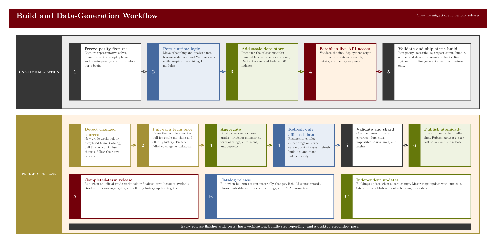
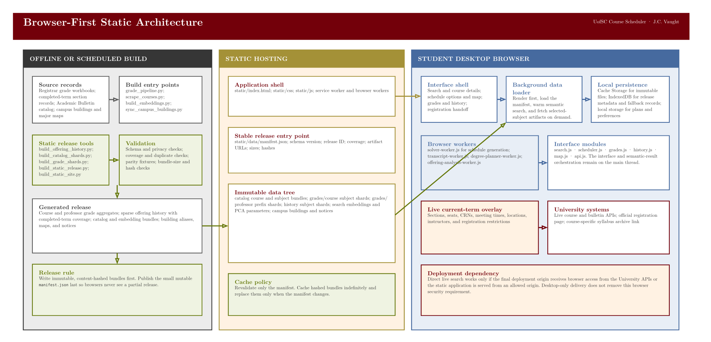

# UofSC Course Scheduler

The UofSC Course Scheduler is a desktop-first semester planning tool for University of South Carolina students. The production build is browser-first. Search ranking, schedule generation, transcript parsing, prerequisite evaluation, historical-grade lookup, offering analysis, and degree-plan calculations run in the student's browser. Managed hosting adds a narrowly scoped relay for current course search, section details, and current faculty identities.

The primary workflow remains planning one semester effectively. Degree planning is available as a secondary browser-local tool.

## Feature Tour

### Build a semester schedule

Students add courses without committing to sections, optionally lock exact sections, and generate ranked conflict-free schedules. Applying an option updates the weekly calendar, campus pins, route estimates, available transition time, and registration handoff.


### Search current courses

Course discovery supports subject codes, exact courses, ranges, Course Reference Numbers, descriptive phrases, and scoped natural-language searches. The semantic model begins warming in the background on the first visit. Search results retain live section availability, course descriptions, instructor counts, and historical grade summaries. Expanded search sources show the phrases used and the result count attributed to each source.


### Inspect a course and section

Selecting a result opens a persistent detail workspace. The selected live section controls the available-seat count, instructor identity and email, meeting pattern, building, Course Reference Number, instructional method, dates, registration notes, calendar, and campus map.


<details>
<summary><strong>Course intelligence and resources</strong></summary>

Historical grades show the course distribution, counted grades, available historical sections, and the current instructor's matched course record.


Selecting an instructor opens a general teaching profile with contact information, courses taught, semesters in the available record, typical annual load, GPA by year, and an external professor-review search.


Completed-term history shows observed offering frequency, seasons, section counts, enrollment, and fill rates.


The resource workspace connects the selected course and section to official class details, bookstore materials, the academic bulletin, the two-step syllabus archive flow, the faculty directory, and external course and professor review searches.


</details>

### Register and plan ahead

The registration handoff includes section-specific checks, individual Course Reference Number copy actions, warning indicators, and a link to the official shopping cart.

<details>
<summary><strong>Registration checklist</strong></summary>


</details>

The degree planner also runs in a browser worker and stores student-entered progress locally.


The screenshots show a Fall 2026 desktop session captured from the deployed site. Live sections, seats, instructors, and restrictions can change after capture.

## Static Build

Install [uv](https://docs.astral.sh/uv/), clone the repository, and build the static distribution.

```bash
git clone https://github.com/j-vaught/UofSC_scheduler.git
cd UofSC_scheduler
uv sync
uv run python scripts/build_static_site.py
```

The generated `dist/client/` directory contains the browser application. Any ordinary static host can serve that directory from the domain root, but live course search, section details, and current faculty identities require the generated managed-host entry point in `dist/server/index.js`. That entry point serves assets and exposes only three fixed read-only relay operations. A local file server remains sufficient for testing browser-local features and static data.

```bash
uv run python -m http.server 8766 --directory dist/client
```

Open `http://127.0.0.1:8766` in a desktop browser. The Python process in this command only serves files during local testing. It is not part of the deployed application.

The older comparison runtime remains available with `uv run python app.py`. It is useful for parity checks and local live-data testing, but it is not required by the static application shell, workers, solver, historical data, or degree planner.

## Live University Data

The University APIs work inside University-owned pages because those pages share an origin with the APIs. A separately hosted scheduler is a cross-origin caller. Managed deployment therefore uses same-origin `POST /api/search`, `POST /api/details`, and `POST /api/faculty` routes. The hosting runtime forwards only validated course-search, Course Reference Number detail, and bounded faculty requests to fixed upstream addresses. It returns fresh JSON without forwarding visitor cookies or upstream response headers.

The live client coalesces duplicate requests, limits concurrency, applies short freshness windows, and supports cancellation. Current faculty records use a privacy-safe hash of the University's stable faculty identifier. Email is normalized and displayed as corroborating contact information, while a unique token-bounded name match remains the conservative fallback when no stable identifier is available. If the relay or upstream service is unavailable, the interface labels live availability as unavailable and continues with verified static catalog, grade, and offering data. It never reports an unverified course as closed or not offered.

## Browser Data and Caching

The active release is described by `static/data/manifest.json`. It currently covers 168 catalog subjects, 9,732 courses, 26 completed terms, 168 Columbia offering-history subject shards, 4,605 publishable course-grade records, 6,442 professor aggregates, and 1,295 official major-map documents spanning the 2020-2021 through 2026-2027 catalog years. Major maps are indexed compactly and loaded one at a time, so selecting a catalog year does not download the complete archive.

The service worker caches the application shell and content-hashed artifacts. Cache Storage retains immutable files. IndexedDB stores release metadata and fallback records. Local storage retains user-owned plans, pane sizes, collapsed panels, and preferences. A page refresh revalidates the manifest and current live requests while preserving the selected search, course, section, and detail tab in the URL.

The official registrar workbooks remain unchanged in `ANALYSIS_and TODO__UofSC Course Scheduler/uofsc_grade_data`. Generated public artifacts suppress aggregates with fewer than ten counted grades. Banner identifiers, source email addresses, and the private matching database are excluded from the static release.

Historical grade point average uses A, B+, B, C+, C, D+, D, F, and FN outcomes. Withdrawals, audits, incompletes, pass or fail outcomes, transfers, and missing grades are excluded. Team-taught sections remain labeled because section-level outcomes cannot be attributed to one instructor independently.

## Release Generation

The one-time migration and periodic release flow are shown below. Python remains an offline build tool for pulling source data, matching registrar records, generating embeddings, validating privacy, and publishing content-hashed releases. No visitor executes that Python code.



Completed-term section data is pulled once and reused for grade matching, professor summaries, enrollment statistics, capacity, and offering history. Catalog records and embeddings regenerate only when bulletin text or the model changes. Campus aliases, curriculum maps, and notices update independently. Immutable artifacts publish before the small mutable manifest so browsers never activate a partial release.

Major maps are imported offline from the official repository PDFs. The importer preserves PDF provenance and the recommended semester sequence, produces conservative planner-compatible fields, and records ambiguous requirements for review instead of fabricating course choices. The standalone validator checks identifiers, catalog years, credits, semester ordering, source integrity metadata, duplicate records, and course-code coverage against the active catalog. Coverage and source gaps are summarized in `data/major_maps_manifest.json`.

The complete architecture, current file tree, cache policy, deployment dependency, and release cadence are documented in [Browser-First Architecture](docs/ARCHITECTURE.md).



## Quality Checks

Run the full formatting, linting, type, Python, JavaScript, static-build, and integrity checks locally.

```bash
uv sync
uv run ruff format .
uv run ruff check . --fix
uv run ty check .
uv run pytest -q
node --test tests/*.js
uv run python scripts/build_static_site.py
```

The current release passes 73 Python tests and 190 JavaScript tests. The builder validates every manifest byte count and SHA-256 digest, rejects representative data by default, excludes application processes and databases from `dist/`, and emits deployment security and cache headers. Production relay verification loads live search results, section details, and stable current-faculty identities while rejecting cross-origin and unsupported-method requests.

## Application Structure

```text
static/
├── index.html                     Browser application shell.
├── service-worker.js              Offline shell and immutable-data cache.
├── css/                           Search, schedule, grade, map, and modal styles.
├── js/
│   ├── api.js                     Static data boundary and legacy comparison switch.
│   ├── live-university-client.js  Bounded current-term relay client.
│   ├── data-store.js              Manifest, integrity, Cache Storage, and IndexedDB.
│   ├── solver-core.js             Browser-safe semester solver.
│   ├── solver-worker.js           Schedule-generation worker.
│   ├── runtime/                    Transcript, degree, and offering-analysis cores.
│   └── workers/                    Transcript, degree, and offering-analysis workers.
└── data/
    ├── manifest.json              Mutable active-release pointer.
    ├── releases/                  Immutable catalog, grade, history, and major-map shards.
    ├── course_embeddings.json     Browser semantic-search data.
    ├── phrase_embeddings.json     Generated search phrases.
    ├── pca_params.json            Search projection parameters.
    ├── campus_buildings.json      Campus aliases and coordinates.
    └── site_notices.json          Static maintenance and action banners.

scripts/                           Offline release and static-site builders.
data/maps/imported/                Reviewed JSON projections of official major-map PDFs.
data/major_maps_manifest.json      Archive coverage and validation summary.
tests/                             Python and JavaScript parity and regression checks.
dist/client/                       Generated static deployment directory.
dist/server/index.js               Managed asset server and fixed live-data relay.
app.py                             Optional legacy comparison runtime.
grade_pipeline.py                  Offline registrar and section matching pipeline.
```

## Site Notices

Maintenance, help, and student-action banners are configured in `static/data/site_notices.json`. Each notice can have an active window and revision. Dismissals are stored by notice identifier and revision, so an updated notice can appear again without an application endpoint.

## Data Sources and License

The application reads course information from `classes.sc.edu`, catalog and prerequisite information from `academicbulletins.sc.edu`, section and instructor information from Banner, official grade-spread workbooks from the University Registrar, and map data from OpenStreetMap services.

The project is maintained by J.C. Vaught and distributed under the MIT license.
