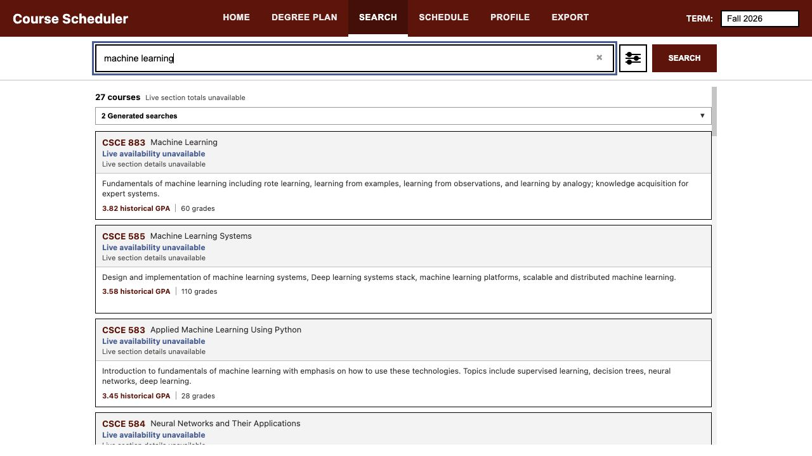
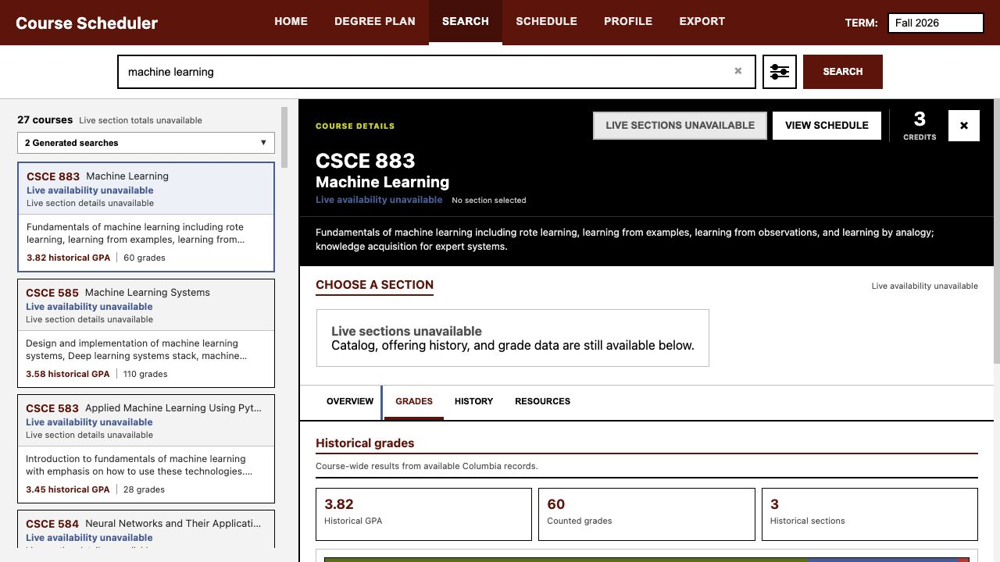
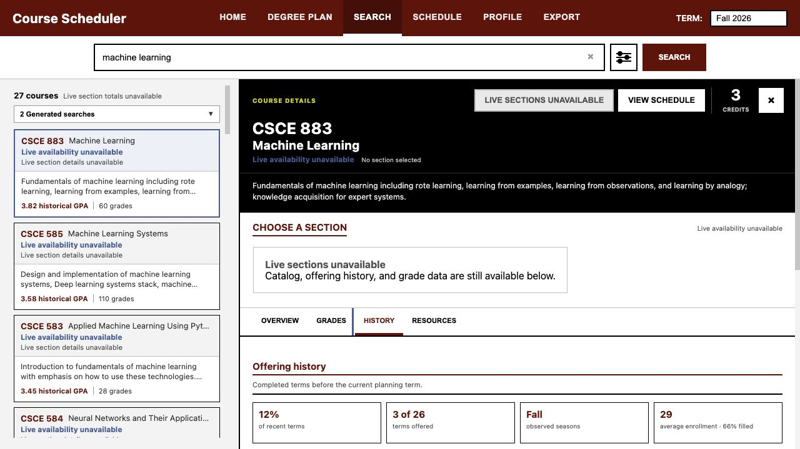
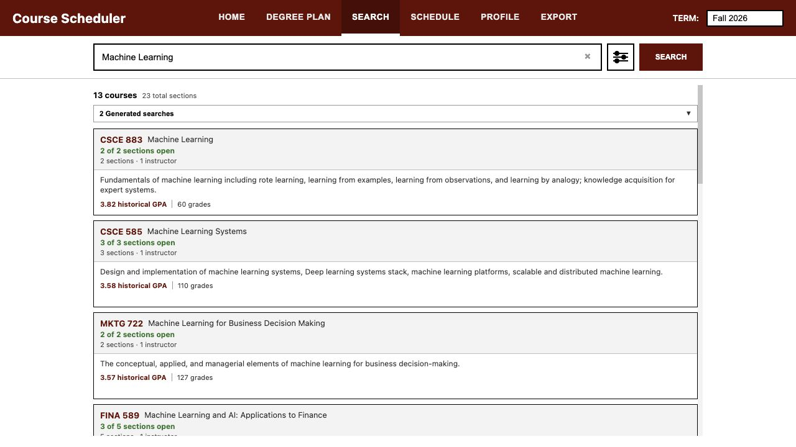
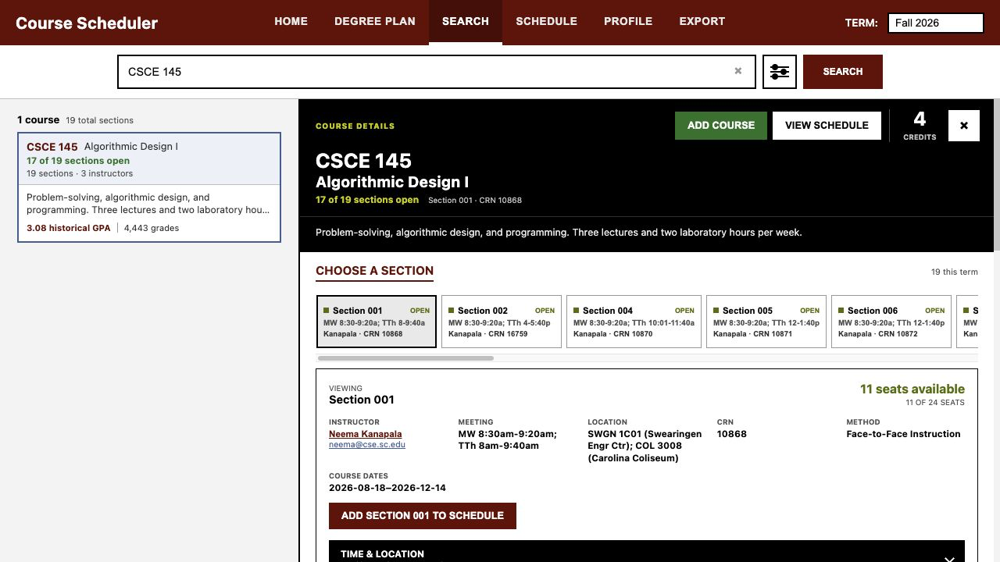
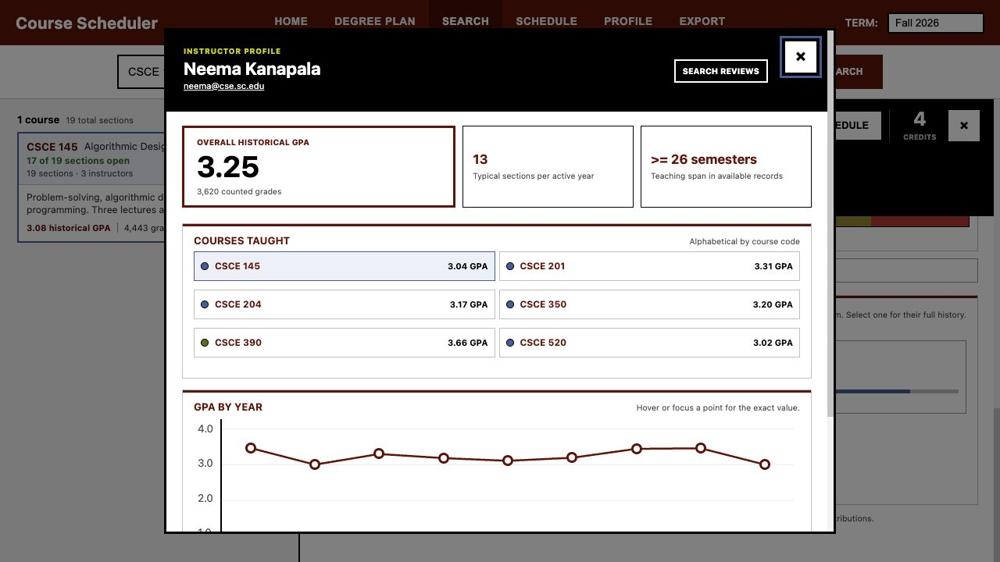
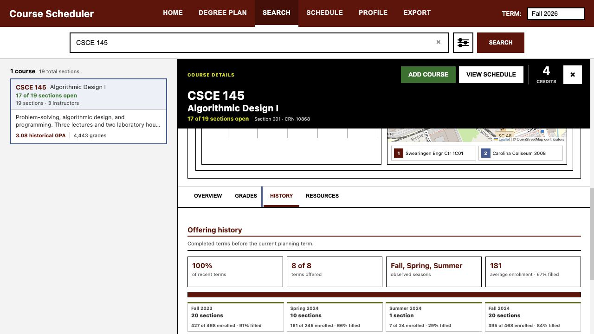

# UofSC Course Scheduler

A desktop-first semester planning tool for University of South Carolina students. Add courses without
committing to sections, optionally lock exact sections, and generate ranked conflict-free schedules. Applying
an option updates the weekly calendar, campus pins, walking-route estimates, and a registration handoff.

Everything interactive runs in the browser. Search ranking, schedule generation, prerequisite evaluation,
transcript parsing, offering analysis, and degree planning are client-side. Hosting serves files and forwards
exactly three validated read-only requests to the University. Plans and transcript-derived progress never
leave the device.

[**Open the live scheduler**](https://scheduler.j-vaught.chatgpt.site/) ·
[**Technical manual**](docs/manual.html)

---

## Interface layout

Three tabs: **SEARCH**, **DEGREE PLAN**, and **SCHEDULE**. The term selector sits at the top right and
scopes everything below it.

### SEARCH — a two-panel workspace

Results list on the left, a persistent course detail panel on the right, separated by a divider you can drag
or resize from the keyboard. Selecting a result opens it on the right without losing your place in the list.


The search box accepts subject codes, exact courses, ranges (`CSCE 140-199`), level shorthand (`CSCE 500+`,
`CSCE 5xx`), CRNs, and descriptive natural-language phrases. The semantic model warms in the background on
first visit. The **Search sources** dropdown expands to show which phrases were generated and how many
results each contributed, so a surprising result set is explainable rather than opaque.

The detail panel keeps a sticky header — course code, title, live section status, credits — above four tabs:
**Overview**, **Grades**, **History**, and **Resources**.


Historical grades show the distribution, counted grades, available historical sections, and the current
instructor's matched record.


Selecting an instructor opens a teaching profile: contact details, courses taught, semesters on record,
typical annual load, GPA by year, and an external review search.


Offering history uses a year-by-season matrix. Color separates offered, not offered, and unavailable terms,
and each offered term expands to section, enrollment, and fill-rate detail.


The Resources tab connects the selected course and section to official class details, bookstore materials,
the academic bulletin, the two-step syllabus archive flow, the faculty directory, and independent course and
professor review searches.


### DEGREE PLAN — a four-step wizard

**Program → Coursework → Strategy → Plan.** Imported official major maps preserve catalog year, the
recommended semester sequence, credit ranges, Carolina Core requirements, and a link back to the source PDF.
You can also upload an advising transcript or build a custom map that stays on your device.


### SCHEDULE — sidebar, options, calendar, routes

A course-search sidebar on the left; generated schedule options and a weekly calendar on the right; a
walking-route map below a draggable resizer. Course blocks are colored in brand-accent order — Atlantic,
Congaree, Horseshoe, Rose, Honeycomb, then Warm Grey — with garnet reserved for application chrome. The grid
expands to seven days automatically when a section meets on a weekend.


Registration is a handoff, never an action taken on your behalf. The checklist surfaces per-section warnings,
prerequisites, seat status, and individual CRN copy buttons for pasting into OneCarolina.


### Degrading without lying

When the live relay or the upstream University service is unavailable, the interface labels availability as
unknown and continues from verified static catalog, grade, and offering data. It never reports an unverified
course as closed or not offered.







<details>
<summary><strong>Earlier interface</strong> — four screenshots from before the navigation was reduced</summary>

These predate the current three-tab layout and show the retired
`HOME | DEGREE PLAN | SEARCH | SCHEDULE | PROFILE | EXPORT` navigation. Kept as a visual record of how the
interface narrowed.









</details>

> Screenshots show Fall 2026 desktop sessions. Live sections, seats, instructors, and restrictions change
> after capture. The two schedule captures and the three degrading-mode captures above also predate the
> navigation change — the features they show are current, the tab bar is not.

---

## Repository layout

Four data directories encode one distinction: **what can be rebuilt**.

```
tools/                Build + pipeline scripts, and tools/README.md.
                      Name is load-bearing: `from tools.X import Y`.
  src/                Offline data generation — three entry points, run by hand:
                      scrape_courses.py, build_embeddings.py, grade_pipeline.py
  contracts/wire/     The FOSE wire contract — single source of truth for the
                      relay, shared by the build, the JS runtime codec, and tests.

data/
  raw/         249M   Originals with no regeneration path — irreplaceable
  curated/      49M   Machine-extracted, then human-reviewed. Source of truth.
  generated/    26M   Fully rebuildable from raw/ + tools/

static/         66M   THE DEPLOYED SITE. Name is load-bearing — every asset URL
                      is absolute `/static/...` and the release manifest bakes
                      that prefix into all 509 artifacts.

docs/           3.1M  manual.html + screenshots/
tests/                12 Python + 17 JavaScript suites
```

**`raw/` is what you cannot get back.** The 26 registrar workbooks have no regeneration path anywhere, and
the 1,295 official major-map PDFs are hash-verified against a manifest. **`generated/` is what a script
rebuilds** from those. `curated/` sits between them: machine-extracted, then human-reviewed, and the only
tier the release build reads.

A `.gitattributes` marks the generated trees `-diff -merge linguist-generated=true`, so regenerated artifacts
stay out of pull-request diffs and a conflict fails loudly rather than splicing two builds together.

### What ships and what does not

The deployed site is `static/` — one HTML entry point, 31 JavaScript modules, three stylesheets, a service
worker, and a content-addressed release payload of 509 artifacts totalling 39.5 MB, each verified by SHA-256
in the browser before use. No Python ever reaches it; the build refuses to copy `.py`, `.db`, or `.sqlite`
into the output at all.

The only server-side component is a three-route relay — `/api/search`, `/api/details`, `/api/faculty` —
which lives in [`server/index.js`](server/index.js) and is copied verbatim into `dist/server/` at build time.
It validates every request body against an exact shape, caps size and timeout, enforces same-origin, and
forwards no credentials in either direction.

Run it locally against a build:

```bash
uv run python tools/build_static_site.py --allow-representative
node server/dev-server.js
```

---

## Quick start

```bash
git clone https://github.com/j-vaught/UofSC_scheduler.git
cd UofSC_scheduler
uv sync
uv run python tools/build_static_site.py
uv run python -m http.server 8766 --directory dist/client
```

Open `http://127.0.0.1:8766`. It must be served from a **domain root** on **localhost** rather than
`file://` — asset paths are absolute, the service worker registers at scope `/`, and `crypto.subtle` is
unavailable on insecure origins, which the data store treats as a hard failure rather than degrading to
unverified data.

```bash
uv run ruff format . && uv run ruff check . --fix
uv run pytest -q          # 83 passed
node --test tests/*.js    # 237 passed
```

The JavaScript suite runs on the Node built-in test runner. There is no external framework and no
`npm install` step.

---

## Documentation

[**docs/manual.html**](docs/manual.html) is the single technical source — runtime architecture, the relay
contract, Banner field notes, the fifteen-stage build pipeline, the major-map schema and extraction prompt,
the feature roadmap, and known issues. [**tools/README.md**](tools/README.md) covers the build pipeline
specifically.

## Site notices

Maintenance, help, and student-action banners are configured in `static/data/site_notices.json`. Each notice
can carry an active window and a revision. Dismissals are stored by notice identifier and revision, so an
updated notice can reappear without an application endpoint.

## Data sources and license

Course information from `classes.sc.edu`, catalog and prerequisite information from
`academicbulletins.sc.edu`, section and instructor information from Banner, official grade-spread workbooks
from the University Registrar, and map data from OpenStreetMap services.

Maintained by J.C. Vaught and distributed under the MIT license.
