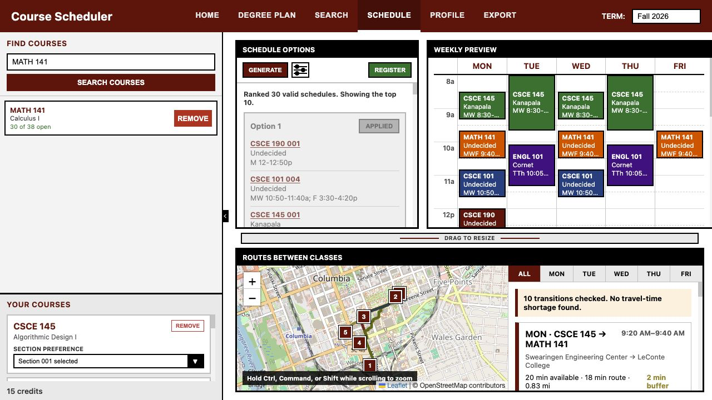
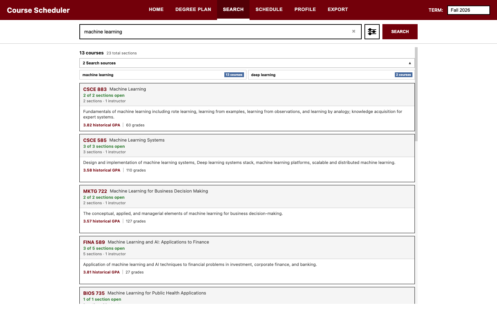
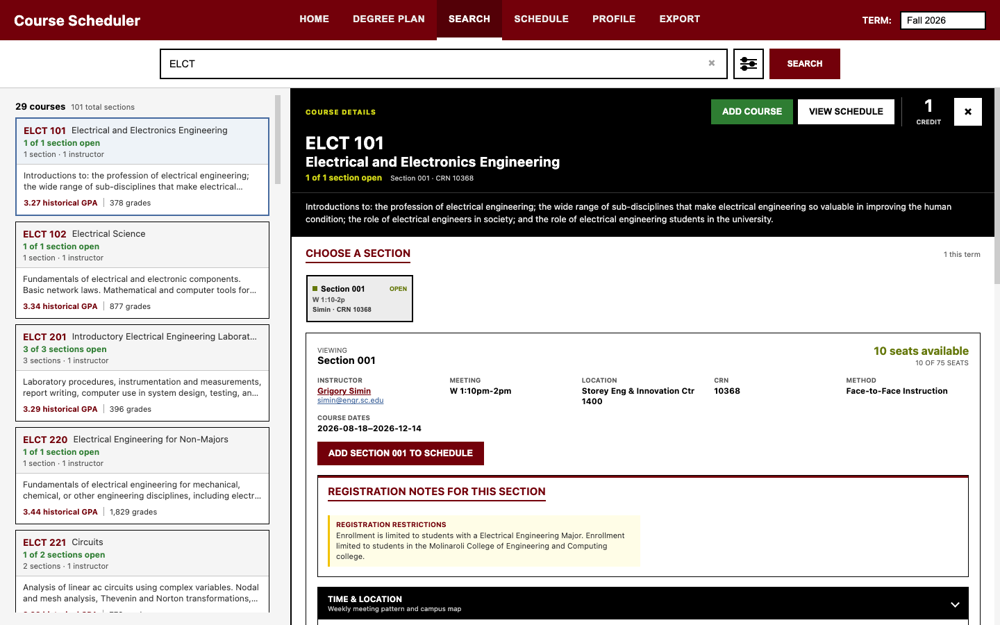
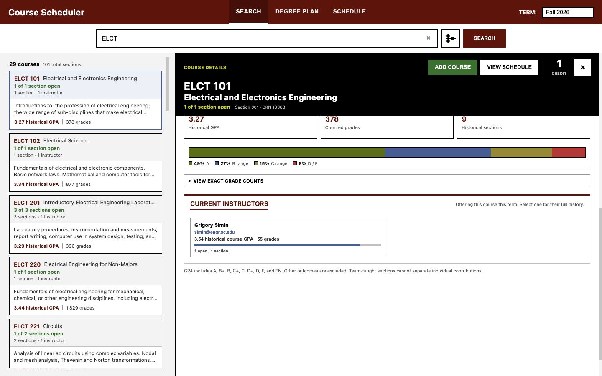
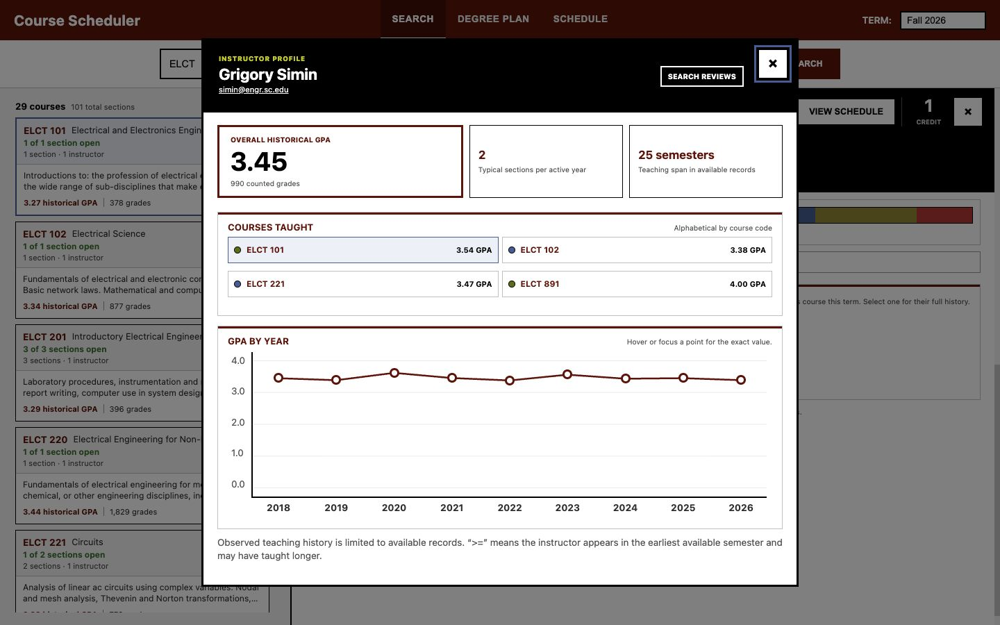
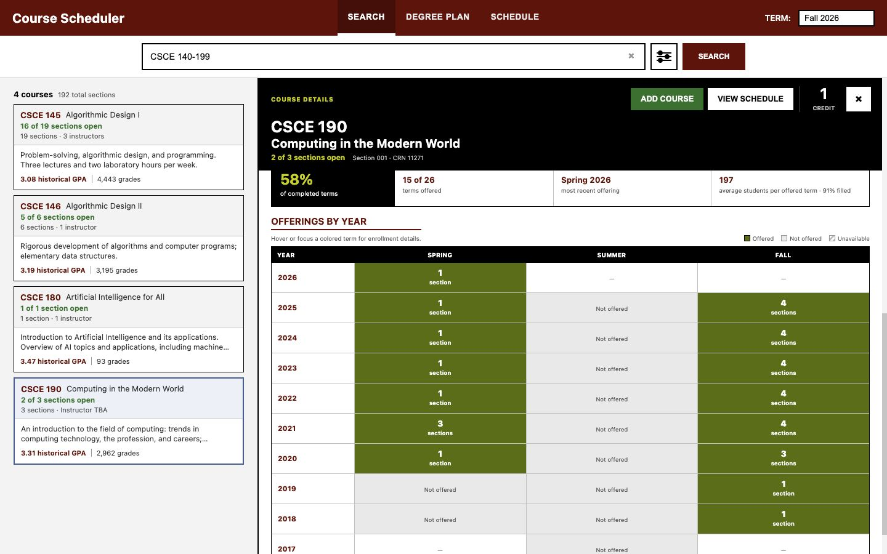
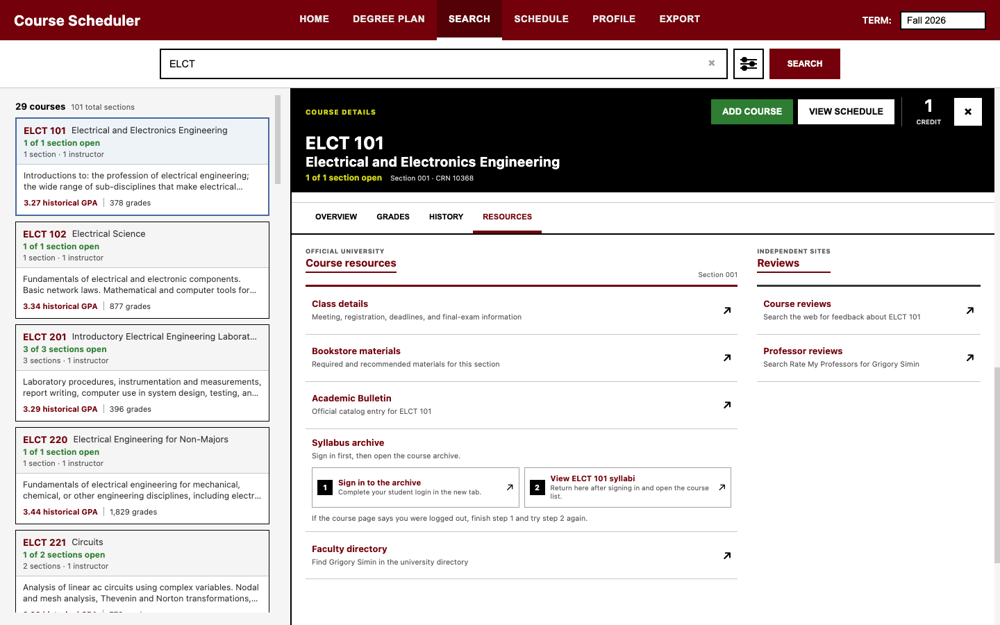
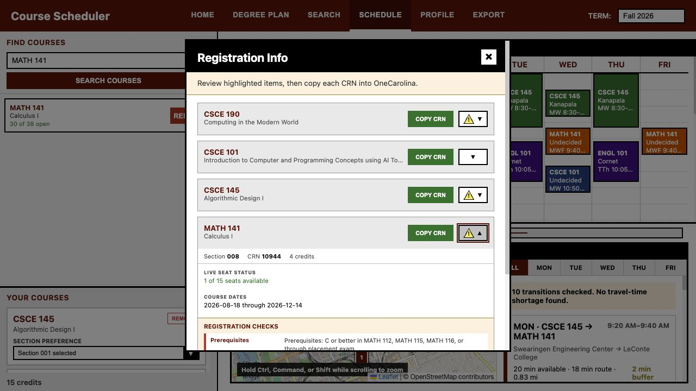
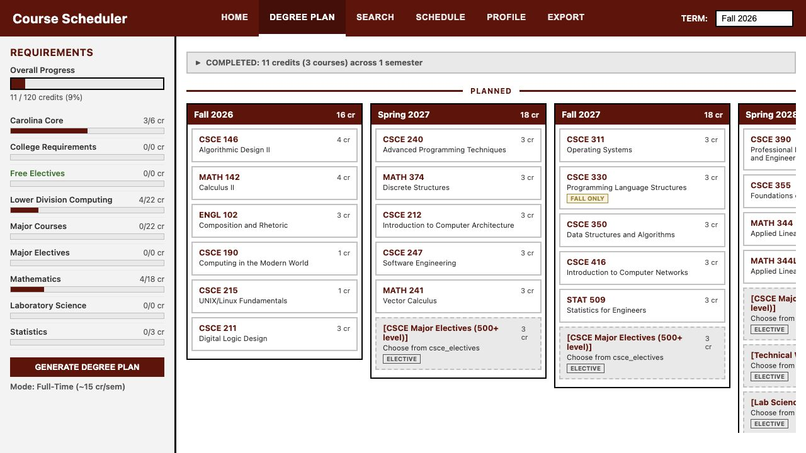

# UofSC Course Scheduler

The UofSC Course Scheduler is a desktop-first semester planning tool for University of South Carolina students. The production build is browser-first. Search ranking, schedule generation, transcript parsing, prerequisite evaluation, historical-grade lookup, offering analysis, and degree-plan calculations run in the student's browser. Managed hosting adds a narrowly scoped relay for current course search, section details, and current faculty identities.

The primary workflow remains planning one semester effectively. Degree planning is available as a secondary browser-local tool.

[Open the live scheduler](https://scheduler.j-vaught.chatgpt.site/)

## Feature Tour

### Build a semester schedule

Students add courses without committing to sections, optionally lock exact sections, and generate ranked conflict-free schedules. Applying an option updates the weekly calendar, campus pins, route estimates, available transition time, and registration handoff.



### Search current courses

Course discovery supports subject codes, exact courses, ranges, Course Reference Numbers, descriptive phrases, and scoped natural-language searches. The semantic model begins warming in the background on the first visit. Search results retain live section availability, course descriptions, instructor counts, and historical grade summaries. Expanded search sources show the phrases used and the result count attributed to each source.



### Inspect a course and section

Selecting a result opens a persistent detail workspace. The selected live section controls the available-seat count, instructor identity and email, meeting pattern, building, Course Reference Number, instructional method, dates, registration notes, calendar, and campus map.



<details>
<summary><strong>Course intelligence and resources</strong></summary>

Historical grades show the course distribution, counted grades, available historical sections, and the current instructor's matched course record.



Selecting an instructor opens a general teaching profile with contact information, courses taught, semesters in the available record, typical annual load, GPA by year, and an external professor-review search.



Completed-term history uses a year-by-year Spring, Summer, and Fall matrix. Color distinguishes offered, not offered, and unavailable terms, while each offered term exposes section, enrollment, and fill-rate details.



The resource workspace connects the selected course and section to official class details, bookstore materials, the academic bulletin, the two-step syllabus archive flow, the faculty directory, and external course and professor review searches.



</details>

### Register and plan ahead

The registration handoff includes section-specific checks, individual Course Reference Number copy actions, warning indicators, and a link to the official shopping cart.

<details>
<summary><strong>Registration checklist</strong></summary>



</details>

The degree planner guides students through program selection, prior coursework, planning strategy, and the generated multi-semester plan. Imported official major maps preserve catalog year, recommended semester order, credit ranges, Carolina Core requirements, and a link to the source PDF. Students can also upload an advising transcript or build a custom major map. Plans and transcript-derived progress remain on the student's device.



The screenshots show a Fall 2026 desktop session captured from the deployed site. Live sections, seats, instructors, and restrictions can change after capture.

## Documentation

Everything technical lives in one place: **[docs/manual.html](docs/manual.html)** — architecture, the
relay contract, Banner field notes, the fifteen-stage build pipeline, the major-map schema and extraction
prompt, the feature roadmap, and known issues. Open it in a browser.

## Quick Start

```bash
git clone https://github.com/j-vaught/UofSC_scheduler.git
cd UofSC_scheduler
uv sync
uv run python scripts/build_static_site.py
uv run python -m http.server 8766 --directory dist/client
```

Then open `http://127.0.0.1:8766`. It must be served from a domain root on `localhost` rather than
`file://`; the manual explains why. Tests are `uv run pytest -q` and `node --test tests/*.js`.

## Site Notices

Maintenance, help, and student-action banners are configured in `static/data/site_notices.json`. Each notice can have an active window and revision. Dismissals are stored by notice identifier and revision, so an updated notice can appear again without an application endpoint.

## Data Sources and License

The application reads course information from `classes.sc.edu`, catalog and prerequisite information from `academicbulletins.sc.edu`, section and instructor information from Banner, official grade-spread workbooks from the University Registrar, and map data from OpenStreetMap services.

The project is maintained by J.C. Vaught and distributed under the MIT license.
